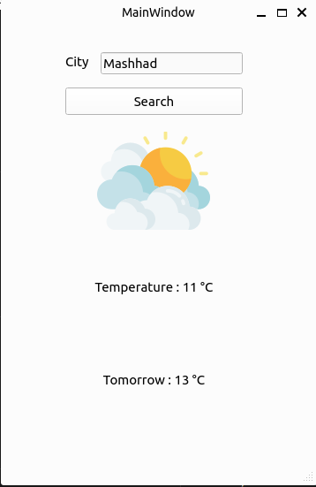

## Weather API  
This Weather API provides a simple and easy-to-use interface for retrieving weather information based on a specific location. It utilizes the https://goweather.herokuapp.com/weather website to fetch weather details for a given city.  
<br>
### Usage  
```
python weather_api.py
```


